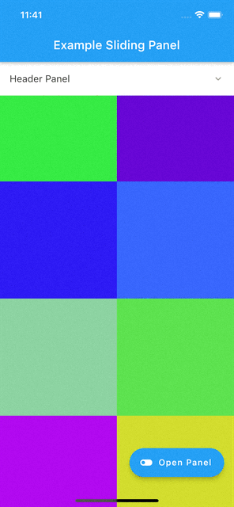

# sliding_up_panel
[](https://pub.dev/packages/sliding_top_panel)
[](https://pub.dev/packages/sliding_top_panel)
[](https://img.shields.io/badge/platform-Android%20%7C%20iOS-green.svg)

A flutter widget that allows you to display a sliding top panel, this widget works on both Android & iOS.

## Installing
Add the following to your `pubspec.yaml` file:
```yaml
dependencies:
  sliding_top_panel: ^0.0.1
```

<br>

## Demo


<br>

## How to use

```dart
  late final SlidingPanelTopController _controller;

  @override
  void initState() {
    _controller = SlidingPanelTopController();
    super.initState();
  }

  @override
  void dispose() {
    _controller.dispose();
    super.dispose();
  }

@override
  Widget build(BuildContext context) {
    return Scaffold(
      appBar: AppBar(
        title: Text(widget.title),
      ),
      body: SlidingTopPanel(
        // maxHeight: 100,
        decorationPanel: const BoxDecoration(
          color: Colors.white,
          borderRadius: BorderRadius.only(
            bottomLeft: Radius.circular(10),
            bottomRight: Radius.circular(10),
          ),
        ),
        controller: _controller,
        header: Container(
          height: 55,
          color: Colors.white,
          child: ListTile(
            title: const Text("Header Panel"),
            trailing: Icon(
              _isPanelVisible
                  ? Icons.keyboard_arrow_up_rounded
                  : Icons.keyboard_arrow_down_rounded,
              size: 20,
              color: Colors.black45,
            ),
            onTap: _controller.toggle,
          ),
        ),
        panel: (_) => _listPanel(),
        body: _gridView(),
      ),
      floatingActionButton: FloatingActionButton.extended(
        onPressed: _controller.toggle,
        tooltip: 'Increment',
        icon: const Icon(Icons.toggle_off),
        label: Text(_isPanelVisible ? 'Close Panel' : 'Open Panel'),
      ),
    );
  }
```